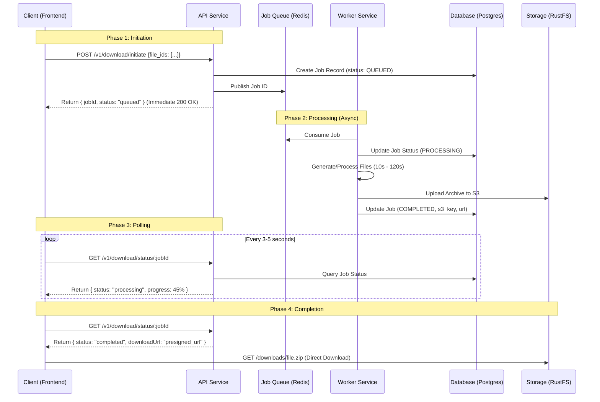

# Challenge 2: Long-Running Download Architecture Design

This document outlines the architectural solution for handling variable processing times (10s-120s+) in the file download microservice. The design addresses critical issues such as connection timeouts (Cloudflare 100s limit), gateway errors (504), and poor user experience.

## 1. Architecture Diagram

The system adopts an **Asynchronous Job Queue** pattern. This decouples the client's HTTP request from the long-running processing task.



## 2. Technical Approach: Option A (Polling Pattern)

We selected the **Polling Pattern** as the primary strategy.

### Justification
1.  **Resilience to Timeouts**: By returning a `jobId` immediately, we completely eliminate the risk of hitting the 100s Cloudflare/Nginx timeout limit. The initial request takes milliseconds.
2.  **Resource Efficiency**: The API server does not hold an open connection/thread for 120 seconds. It immediately frees resources to handle other requests.
3.  **Simplicity & Reliability**: Unlike WebSockets (which require stateful connections and complex sticky sessions or pub/sub) or Webhooks (which require the client to be a server/publicly accessible), polling is stateless and works in every client environment (browser, mobile, CLI).
4.  **User Feedback**: It allows the frontend to show a granular progress bar (if the worker updates progress) or a simple "Processing..." spinner, vastly improving UX over a hanging request.

## 3. Implementation Details

### API Contract Changes

#### New Endpoint: Get Job Status
`GET /v1/download/jobs/:jobId`

**Response (Processing):**
```json
{
  "jobId": "uuid-1234",
  "status": "processing",
  "createdAt": "2025-12-12T10:00:00Z",
  "estimatedTimeLeft": 60
}
```

**Response (Completed):**
```json
{
  "jobId": "uuid-1234",
  "status": "completed",
  "completedAt": "2025-12-12T10:02:00Z",
  "downloadUrl": "https://storage.example.com/downloads/uuid-1234.zip?signature=...",
  "size": 1024000
}
```

### Database Schema
We will use a relational database (Postgres) to track job state durability.

```sql
CREATE TABLE download_jobs (
    id UUID PRIMARY KEY DEFAULT gen_random_uuid(),
    status VARCHAR(20) NOT NULL CHECK (status IN ('queued', 'processing', 'completed', 'failed')),
    file_ids JSONB NOT NULL,
    s3_key VARCHAR(255),
    error_message TEXT,
    created_at TIMESTAMP WITH TIME ZONE DEFAULT NOW(),
    updated_at TIMESTAMP WITH TIME ZONE DEFAULT NOW(),
    completed_at TIMESTAMP WITH TIME ZONE
);
```

### Background Job Strategy
*   **Queue System**: BullMQ (Redis-based) is ideal for Node.js. It supports retries, delayed jobs, and priority.
*   **Worker Process**: A separate Node.js process (or container `microops-worker`) that consumes the queue. It performs the CPU-intensive or IO-heavy work of gathering files and zipping them.
*   **Concurrency**: Workers can run in parallel. Kubernetes HPA (Horizontal Pod Autoscaler) can scale workers based on queue depth.

### Error Handling & Retries
*   **Transient Failures** (e.g., S3 network glitch): BullMQ automatically retries the job (exponential backoff strategy: 3 retries).
*   **Permanent Failures** (e.g., Invalid file ID): Worker marks DB status as `failed` with a descriptive message. Client polling receives this status and displays an error toast.
*   **Dead Letter Queue (DLQ)**: Jobs failing max retries are moved to DLQ for manual inspection.

## 4. Proxy Configuration

Since the "long request" is eliminated, we can keep standard timeout settings for the API, but we might want aggressive caching for static assets and lenient settings for the specific download path if *not* using presigned URLs (though presigned is recommended).

### Nginx Configuration
```nginx
server {
    listen 80;
    server_name api.example.com;

    # Standard API requests (fast)
    location / {
        proxy_pass http://api_backend;
        proxy_connect_timeout 5s;
        proxy_read_timeout 30s;      # Sufficient for initiation/polling
    }

    # Optional: If proxying downloads directly (not presigned)
    location /download/content/ {
        proxy_pass http://storage_backend;
        proxy_read_timeout 300s;     # Allow long time for large file transfer
        proxy_buffering off;         # Stream immediately
    }
}
```

### Cloudflare
*   **Timeouts**: Default is 100s. With our polling architecture, our longest API call is < 1s, so we are safe.
*   **Caching**: We should cache the `GET /v1/download/jobs/:jobId` response for 1-2 seconds to reduce DB load from aggressive pollers.

## 5. Frontend Integration (React/Next.js)

### State Management
Using a hook like `useDownloadJob` or libraries like `TanStack Query` (React Query).

### Workflow
1.  **Initiate**: User clicks "Download". App calls `POST /initiate`.
2.  **State Update**: App receives `jobId`, sets UI state to `IS_POLLING`. Shows progress modal.
3.  **Poll**: `useInterval` hook triggers `GET /jobs/:jobId` every 3 seconds.
4.  **Complete**: API returns `status: "completed"`. App clears interval.
5.  **Trigger**: App automatically creates a hidden `<a>` tag with `downloadUrl` and clicks it, or shows a "Click to Save" button.

### User Experience
*   **Optimistic UI**: "Your download is being prepared..."
*   **Progress**: "Processing... (Estimated 45s)"
*   **Navigation**: Since it's async, the user can navigate away. We can show a global "Downloads" toast/widget in the corner that keeps polling globally.

